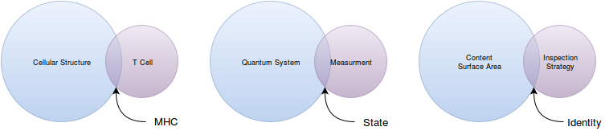
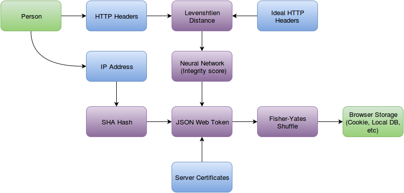

The Janus Engine
=================

The Janus Engine seeks to exploit human psychology to make anonymous political participation more profitable than the curated ideology gardens that power contemporary Internet media consumption.  Please review the [project's philosophy](PHILOSOPHY.md) to understand the nature of this challenge.

Anonymous Political Participation
=================================

North America has 528,700,000 people, 19,354 cities and towns, 3,142 counties, 311 languages, 14 recognized races (with Hispanic variants as well), 2 sexes, and only *two* major political brands.  This mass ideological homogenization has not only [failed to promote meaningful representation in matters of public policy](https://www.youtube.com/watch?v=5tu32CCA_Ig), but it has [promoted self-isolation and self-censoring behavior to destroy social cohesion.](http://www.ncbi.nlm.nih.gov/pubmed/16574334).  Paradoxically, the illusion of internet anonymity can help people regain a sense of social cohesion.  This type of cohesion forges a newidentity that is often blended across an entire spectrum of cultural, racial, national, social, classical, and other identities.  It's only a matter of time before this new identity organizes itself politically to circumvent the failed promises and predictions of their previous identity affiliations.  It is also a matter of time before certain mechanisms of anonymous political participation are demonized and then outright criminalized to protect the old identities.

So what is anonymous political participation?

Anonymous political participation means participating in political discourse while minimizing the surface area of shame attacks.  This allows ideas to propagate and for people to coordinate as the fear of social reprisal is minimized.  By promoting anonymous political participation, the internet can once more become a marketplace of ideas as major political brands will struggle to define the criteria for social reprisal.

Theory
======
The concept of identity is commonly understood to be something that is self-defined.  For example, for the American census, race and ethnicity data is mostly self-reported.  Academia and activists have worked to expanded this self-reporting activity to include gender as well.  The entire premise of this mechanism of identity is that the self is the ultimate authority about itself.  It also allows for the creation of an infinite stream of identities to validate nearly any activity.  Because of this, this theory of identity is circular and unfalsifiable, and thus, is more similar to Bronze Age religions than reality.

Janus Engine operates on a different assumption: *Identity is the cross-section between the surface area of content interaction and an inspection strategy.*  Curiously, this interaction appears in other contexts of validation as well:

Each person possesses a **psychological topology**.  The measurable characteristics of this topology manifest as the consumption and creation of **content**.  (Approximated via Shannon Entropy)  As a person moves through time, the surface area of their psychological topology distorts as they interact with and generate content.  Any attempt at inspecting the surface area (from self-origin or otherwise) will create an **identity**; *a fusion between the biases within the inspection strategy and a subset of the surface area*.

As an analogy, a metal key is a configuration of physical topology that matches a tumbler configuration somewhere in the universe.  If that topology distorts, then the key can no longer be used on the tumbler it's paired with.  Keys are generated for specific use cases and they are held together by a key chain.

A person doesn't just possess one identity.  They possess many identities.  Each identity is generated for specific use cases and they are held together by the psychological topology.  The psychological topology can never be observed directly.  It can only be inferred through continuous measurement of its surface area.

Implementation
==============

With this definition of identity, the Janus Engine assumes that one person has many identities and will deploy them to solve problems.  Instead of representing a user as a single account and tying all content consumption/generation to that account, the Janus Engine allows users to easily create and manage multiple anonymous identities with identity keys.  These keys are not stored in a master account or verified via second-party identity systems such as email or phone numbers.  Instead, each user manages their own identity keys which are optionally stored aggressively in a wide variety of browser storage technologies for convenience.  Additionally, users will be able to download their identity keys and share them between devices easily.

This is how identity keys are generated:

* A person makes a request to the server
* The text of the HTTP headers are compared against the text of ideal HTTP headers to generate several Levenshtien distances.
* Those distances are ran through a neural network trained in valid HTTP header scenarios to calculate the integrity score of the request.
* The IP of the request is hashed with rotating salt (determined by using the IP numbers) via SHA-256.
* The integrity score and the hashed IP are used to create a [JSON Web Token](https://github.com/auth0/node-jsonwebtoken).
* That token is then returned to the user.
* The user then types in a passphrase, which becomes the seed for a [client-side randomization strategy](https://github.com/davidbau/seedrandom/blob/released/seedrandom.js)  (Client-side JS is not cryptographically secure, so this algorithm requires careful review).
* A Fisher-Yates shuffle is applied to the JSON token, based on the random seed, which is then stored into the browser or downloaded directly.
* When a user wishes to use an identity key, they have to type the passphrase locally to reapply the Fisher-Yates shuffle to restore the JSON Web Token.
* Every use of the JSON Web Token runs subsequent HTTP Request differences through the neural network to generate an integrity score.  That score is then compared to the score held within the JSON Web Token.  If the integrity score deviates too much, then any content that identity reads or generates will be flagged as suspicious.
* When that token comes from a new IP, the JSON Web Token will be modified to include that IP in it's hash.  The user will be given this updated token and then be prompted to reapply their passphrase.